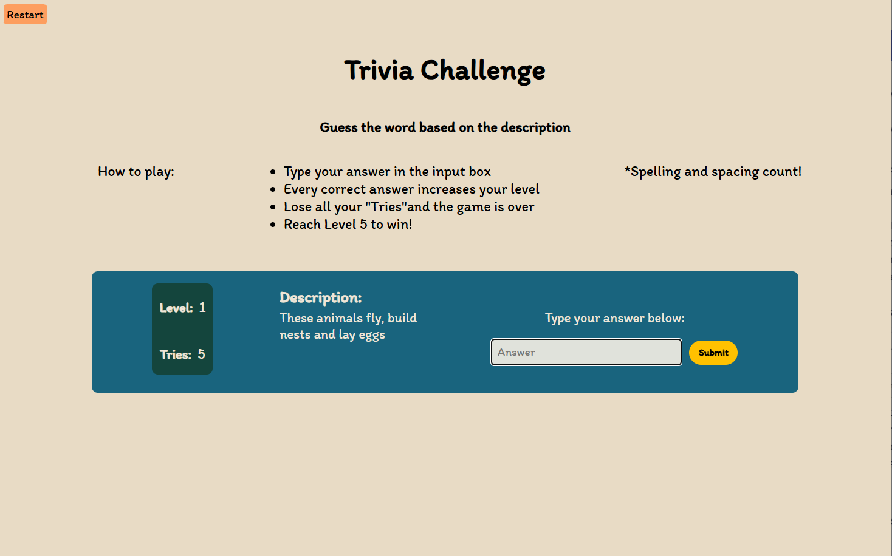
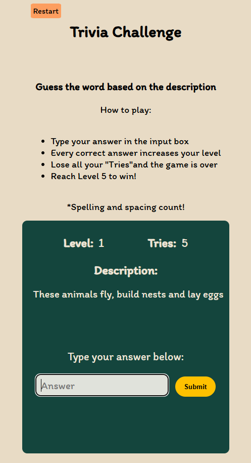

# Trivia Challenge Game
## A browser-based trivia game made with HTML CSS and Javascript. 

The player has 5 tries to reach the end of the game which is 5 levels. 
Each level consists of one question the user must answer correctly before moving on. 
If the player runs out of tries before completing level 5, the game is over with the option to try again.
If the user enters the correct answer, a message is displayed to the user indicating a correct answer and their level is increased allowng them to move on to the next level. 
If an incorrect answer is entered, a corresponding message is displayed and the user loses a Try. 
If no answer is entered, the user is displayed a message to enter an answer.

## Technologies

## Desktop Version 

## Mobile Version 

Play it [here](https://cpreza24.github.io/word-challenge/)

## Attributions

[CSS-Tricks](https://css-tricks.com/snippets/css/a-guide-to-flexbox/) [Stack overflow](https://stackoverflow.com/) [Contrast Accessibility Checker](https://webaim.org/resources/contrastchecker/) 

## Future Enhancements
I plan to add more questions per level before the player can Level Up to the next round. 
An option for a lightning round when the user completes the main game. 

## Author
Cesar Preza [LinkdIn](https://www.linkedin.com/in/cesar-preza-72675278/) [GitHub](https://github.com/Cpreza24)

